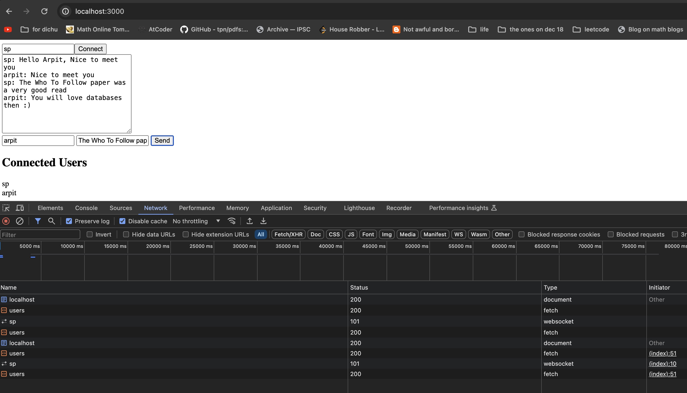

## SP's Slack clone

## How to build

Start the docker

```shell
docker-compose up --build
```

Open browser on the below address

```shell
http://localhost:3000/
```

Add a user name and click on the "Connect" button

Open another browser tab and connect using a differnt username
Now go back to previous tab and use the second username and add text message
and click on the "send" button.
In the second tab you should see the message send from the first user.

From first user's perspective:


From second user's perspective:

